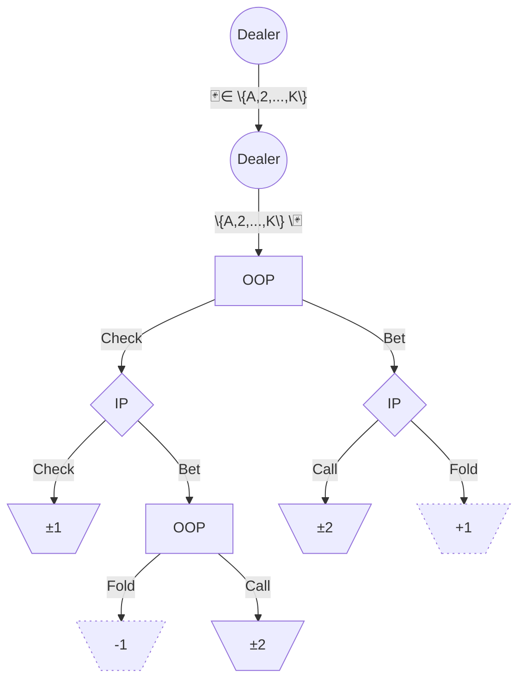

# One-card poker solver

## Introduction

Reproducing Geoffrey J. Gordon's One-card poker[^1] equilibrium findings for the fun of it.  
This toy game is fascinating to me for its sheer simplicity and yet the depth of strategic concepts it sheds light on.  
I went the easy way leveraging [open_spiel's](https://github.com/google-deepmind/open_spiel) Counterfactual Regret Minimization (CFR) implementation.  
I will try to give a more poker player angle to all this.  

## Rules

Think __Heads-up Limit Hold'em__ with the following simplifications:

- 1 card instead of 2 in hand
- 1 suit instead of 4 in the deck _(i.e., 13 total cards)_
- 1 street _(i.e., no community board, no flop, no turn and no river)_
- 1 of maximum bet cap instead of 4 _(i.e., no raise or re-raise)_
- 1/1 blinds instead of 1/2

(If this doesn't speak to you, read Gordon's description that makes no assumption about prior poker knowledge)  
(Also, if you are googling it, don't get confused by another game with the same name played in casino against the bank)

## Build from source

```sh
git clone --recurse-submodules https://github.com/VincentPinet/onecard-poker-solver.git
cd onecard-poker-solver
cmake -B build 
cmake --build build
```

> [!NOTE]  
> CMake is calling open_spiel's `install.sh`[^2] script which is assuming `apt`-based distro  
> You also need a recent enough compiler that support `-std=c++26`  

## Results

Here is the output of my program in the same format as Gordon's:  

Player 2 (IP)

| Holding:   | 2     | 3     | 4     | 5     | 6     | 7     | 8     | 9     | T     | J     | Q     | K     | A     |
| ---------- | ----- | ----- | ----- | ----- | ----- | ----- | ----- | ----- | ----- | ----- | ----- | ----- | ----- |
| On pass:   | 1.000 | 1.000 | 0.000 | 0.000 | 0.000 | 0.000 | 0.000 | 1.000 | 1.000 | 1.000 | 1.000 | 1.000 | 1.000 |
| On bet:    | 0.000 | 0.000 | 0.000 | 0.000 | 0.000 | 1.000 | 1.000 | 1.000 | 1.000 | 1.000 | 1.000 | 1.000 | 1.000 |

Player 1 (OOP)

| Holding:   | 2     | 3     | 4     | 5     | 6     | 7     | 8     | 9     | T     | J     | Q     | K     | A     |
| ---------- | ----- | ----- | ----- | ----- | ----- | ----- | ----- | ----- | ----- | ----- | ----- | ----- | ----- |
| 1st round: | 0.536 | 0.478 | 0.144 | 0.000 | 0.000 | 0.000 | 0.000 | 0.395 | 0.463 | 0.530 | 0.603 | 0.688 | 0.795 |
| 2nd round: | 0.000 | 0.000 | 0.000 | 0.000 | 0.000 | 1.000 | 1.000 | 1.000 | 1.000 | 1.000 | 1.000 | 1.000 | 1.000 |

## Analysis

### Bluff catcher

Here is an excerpt of Player 2's facing a bet (IP call) for both our results:

| Holding:  | 4     | 5     | 6     | 7     | 8     | x̄     |
| --------- | ----- | ----- | ----- | ----- | ----- | ----- |
| Gordon:   | 0.169 | 0.251 | 0.408 | 0.583 | 0.759 | 0.468 |
| Me:       | 0.000 | 0.000 | 0.000 | 1.000 | 1.000 | 0.400 |

He later mentioned it on his website that his strategy is weakly dominated after (Ganzfried and Sandholm 2013)[^3] pointed it out.  
What's funny to me is how obvious this is from a poker player's perspective. Why bother calling with a `4` one-sixth of the time when I am not even calling all my `8`s to begin with ?  
Sure enough, poker players did notice it earlier on the twoplustwo forum ("punter11235", "Alibut" and "beserious" 2009)[^4]. Sometimes you gotta love the internet. I miss the forum days. I am old.  

### Donk

Now an snippet of Player 1's 1st round (OOP bet):  

| Holding:  | 2     | 3     | 4     | 5     | 6     | 7     | 8     | 9     | T     | J     | Q     | K     | A     | x̄     |
| --------- | ----- | ----- | ----- | ----- | ----- | ----- | ----- | ----- | ----- | ----- | ----- | ----- | ----- | ----- |
| Gordon:   | 0.454 | 0.443 | 0.254 | 0.000 | 0.000 | 0.000 | 0.000 | 0.422 | 0.549 | 0.598 | 0.615 | 0.628 | 0.641 | 0.354 |
| Me:       | 0.536 | 0.478 | 0.144 | 0.000 | 0.000 | 0.000 | 0.000 | 0.395 | 0.463 | 0.530 | 0.603 | 0.688 | 0.795 | 0.356 |

Intuitively, one is going to pick _pure-bluff_ with the very bottom of their range. And will want to maximize value with their best hands by betting.  
All of this to the extent of not weakening their check-call range too much and becoming exploitable.  
The balancing of my strategy emphasizes this by, comparatively to Gordon's, bluffing `2`s more and `4`s less; and betting for value `A`s more and `9`s less.  
Overall pretty similar.  

## Implementation

### Game tree



I took some informal liberties. This graph is only one of the $13 \times 12 = 156$ subgraphs for each pair of cards dealable.  
To get a full picture, imagine instead of both dealer's arcs a branch for each card (instead of my mixed emoji set notation) that leads to duplicating what's below.  
Therefore, on terminal node (basket-like trapezoid shape), the ± denotes + or - depending on who wins at showdown. Dotted nodes are non-showdown and show utility from OOP's perspective.  

### Style

I tried to go all in (pun intended) on the _trailing return type_ syntax (for no actual good reason).  
I do like the incidental alignment of names, simply because function signatures start with either `auto` or `void` which are both 4 chars long. Neat.  
Although the `override` decoration being after the return type is a bit weird.  
I also made extensive use of std::ranges (still for no good reason).  

## Future

- [ ] Implement simulation to convince ourselves that both strategies are in fact GTO  
- [ ] Do a TUI interface to actually play and challenge a bot  
- [ ] Measure the delta in outcome between a dominated strategy and a less/non-dominated strategy when played against a random (or a more realistic, yet non-optimal) strategy.

[^1]: [https://www.cs.cmu.edu/~ggordon/poker/](https://www.cs.cmu.edu/~ggordon/poker/)
[^2]: [https://openspiel.readthedocs.io/en/latest/install.html#installation-from-source](https://openspiel.readthedocs.io/en/latest/install.html#installation-from-source)
[^3]: [https://cdn.aaai.org/ocs/ws/ws1066/7139-30510-1-PB.pdf](https://cdn.aaai.org/ocs/ws/ws1066/7139-30510-1-PB.pdf)
[^4]: [https://forumserver.twoplustwo.com/15/poker-theory-amp-gto/solution-1-card-poker-cs-cmu-edu-381120/](https://forumserver.twoplustwo.com/15/poker-theory-amp-gto/solution-1-card-poker-cs-cmu-edu-381120/)
